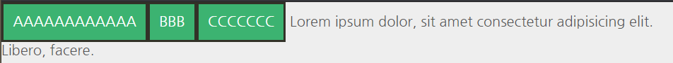
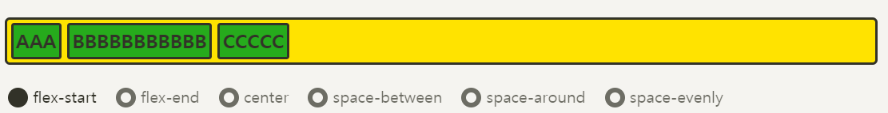
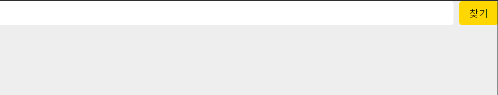
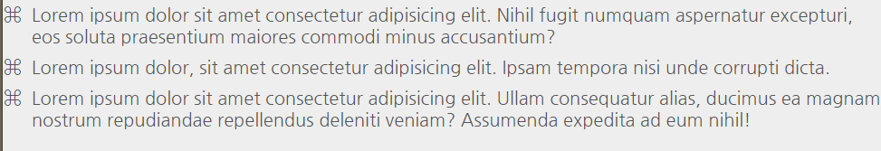

# CSS_Flex_Grid

> flex와 grid는 `Firefox`로 공부하는게 좋다. 
>
> 
>
> 왜냐하면 위 사진처럼 개발자도구에 flex와 grid를 설정할 때 보라색으로 보여준다.

[toc]

## Flex

> [CSS_Flex](https://studiomeal.com/archives/197)
>
>  Flexible Box, Flexbox 라고 부름
>
> 레이아웃 배치 전용 기능으로 고안됨
>
>  Grid로는 구현이 어려운 레이아웃이거나 Flex를 쓰는게 더 편리한 경우도 있다.
>
> 인터넷 익스플로러(IE)같은 경우는 Flex는 표준 스펙을 지원하지만 Grid는 legacy(고인물) 버전만 지원하기 때문에, 둘 다 잘 알아두고 적재적소에 활용하는 것이 가장 좋다

- 부모 요소인 div.container를 Flex Container(플렉스 컨테이너)라고 부르고, 자식 요소인 div.item들을 Flex Item(플렉스 아이템)이라고 부른다.


Flex의 속성들은, 두가지가 있다.

- 컨테이너에 적용하는 속성
- 아이템에 적용하는 속성

### **Flex 컨테이너에 적용하는 속성들**

#### 1) `display:flex;`

```css
.container {
	display: flex;
	/* display: inline-flex; */
}
```


- flex 적용 코드

```html
<!DOCTYPE html>
<html>
<head>
	<meta charset="UTF-8">
	<meta name="viewport" content="width=device-width, initial-scale=1.0">
	<meta http-equiv="X-UA-Compatible" content="ie=edge">
	<title>CSS Flex</title>
	<link rel="stylesheet" href="default.css">
	<style>
		.flex-container {
			display: flex;
			/* display: inline-flex; */
		}
	</style>
</head>
<body>
	<div class="flex-container">
		<div class="flex-item">AAAAAAAAAAAA</div>
		<div class="flex-item">BBB</div>
		<div class="flex-item">CCCCCCC</div>
	</div>
	Lorem ipsum dolor, sit amet consectetur adipisicing elit. Libero, facere.
</body>
</html>
```


#### 2) Float vs Flex

- Flex 아이템들은 가로 방향으로 배치되고, 자신이 가진 내용물의 width 만큼만 차지하게 된다. 마치 inline 요소들 처럼, height는 컨테이너의 높이만큼 늘어난다.


- 위 코드에 `inline-flex`를 처리하면 아래 처럼 된다.




#### 3) 메인축, 교차축

- 아이템들이 배치된 방향의 축을 **메인축**(Main Axis),
- 메인축과 수직인 축을 **수직축 또는 교차축**(Cross Axis)


#### 4) 배치 방향 설정 `flex-direction`

```css
.container {
	flex-direction: row;
	/* flex-direction: column; */
	/* flex-direction: row-reverse; */
	/* flex-direction: column-reverse; */
}
```


##### row (기본값)

아이템들이 행(가로) 방향으로 배치

##### row-reverse

아이템들이 역순으로 가로 배치

##### column

아이템들이 열(세로) 방향으로 배치

##### column-reverse

아이템들이 역순으로 세로 배치

#### 4) 줄넘김 처리 설정 `flex-wrap`

> 컨테이너가 더 이상 아이템들을 한 줄에 담을 여유 공간이 없을 때, 아이템 줄바꿈을 어떻게 할지 결정하는 속성.

```css
.container {
	flex-wrap: nowrap;
	/* flex-wrap: wrap; */
	/* flex-wrap: wrap-reverse; */
}
```


##### nowrap (기본값)

줄바꿈을 하지 않는다. 넘치면 그냥 밖으로 튀어 나간다.

##### wrap

줄바꿈을 한다. float이나 inline-block으로 배치한 요소들과 비슷하게 동작해요.

##### wrap-reverse

줄바꿈을 하는데, 아이템을 역순으로 배치

#### 5) flex-flow

> `flex-direction`과 `flex-wrap`을 한꺼번에 지정할 수 있는 단축 속성
> flex-direction, flex-wrap의 순으로 한 칸 떼고 쓰면 된다.

```css
.container {
	flex-flow: row wrap;
	/* 아래의 두 줄을 줄여 쓴 것 */
	/* flex-direction: row; */
	/* flex-wrap: wrap; */
}
```

#### 6) flex 반응형

```html
<!DOCTYPE html>
<html>
<head>
	<meta charset="UTF-8">
	<meta name="viewport" content="width=device-width, initial-scale=1.0">
	<meta http-equiv="X-UA-Compatible" content="ie=edge">
	<title>CSS Flex</title>
	<link rel="stylesheet" href="default.css">
	<style>
		.flex-container {
			display: flex;
			flex-direction: column;
		}
		/* 600 px 이상이 되면 flex-contianer를 row로 바꿔라 */
		@media (min-width: 600px) {
			.flex-container {
				flex-direction: row;
			}
			.flex-item {
				flex: 1;
			}
		}
	</style>
</head>
<body>
	<div class="flex-container">
		<div class="flex-item">AAAAAAAAAAAA</div>
		<div class="flex-item">BBB</div>
		<div class="flex-item">CCCCCCC</div>
	</div>
</body>
</html>
```

#### 7) flex 정렬

**“justify”는 메인축 방향으로 정렬, “align”은 수직축 방향으로 정렬**


#### 7) 메인축 방향 정렬 justify-content

justify 키워드가 나왔죠? 메인축 방향으로 아이템을들 정렬하는 속성이예요.

```
.container {
	justify-content: flex-start;
	/* justify-content: flex-end; */
	/* justify-content: center; */
	/* justify-content: space-between; */
	/* justify-content: space-around; */
	/* justify-content: space-evenly; */
}
```




##### flex-start (기본값)

아이템들을 시작점으로 정렬.
flex-direction이 row(가로 배치)일 때는 왼쪽, column(세로 배치)일 때는 위.

##### flex-end

아이템들을 끝점으로 정렬.
flex-direction이 row(가로 배치)일 때는 오른쪽, column(세로 배치)일 때는 아래.

##### center

아이템들을 가운데로 정렬.

##### space-between

아이템들의 “사이(between)”에 균일한 간격을 만들어줌.

##### space-around

아이템들의 “둘레(around)”에 균일한 간격을 만들어 줌.

##### space-evenly

아이템들의 사이와 양 끝에 균일한 간격을 만들어 준다.

> 주의! IE와 엣지(Edge)에서는 지원되지 않는다
> 이 웹사이트의 메뉴 부분은 브라우저 폭이 1024px 이상일 때 space-evenly가 적용되도록 했는데, IE와 엣지에서만 space-around로 적용이 됨.

##### space-between, space-around, space-evenly 차이


#### 8) 수직축 방향 정렬 align-items

align 키워드가 나왔죠? 수직축 방향으로 아이템을들 정렬하는 속성이예요.
justify-content와 수직 방향의 정렬이라고 생각하시면 됩니다.

```
.container {
	align-items: stretch;
	/* align-items: flex-start; */
	/* align-items: flex-end; */
	/* align-items: center; */
	/* align-items: baseline; */
}
```


##### stretch (기본값)

아이템들이 수직축 방향으로 끝까지 쭈욱 늘어남.

##### flex-start

아이템들을 시작점으로 정렬.
flex-direction이 row(가로 배치)일 때는 위, column(세로 배치)일 때는 왼쪽.

##### flex-end

아이템들을 끝으로 정렬.
flex-direction이 row(가로 배치)일 때는 위, column(세로 배치)일 때는 왼쪽.

##### center

아이템들을 가운데로 정렬

##### baseline

아이템들을 텍스트 베이스라인 기준으로 정렬


##### justify-content: center; align-item: center;


#### 9) 여러 행 정렬 align-content

flex-wrap: wrap;이 설정된 상태에서, 아이템들의 행이 2줄 이상 되었을 때의 수직축 방향 정렬을 결정하는 속성.

```css
.container {
	flex-wrap: wrap;
	align-content: stretch;
	/* align-content: flex-start; */
	/* align-content: flex-end; */
	/* align-content: center; */
	/* align-content: space-between; */
	/* align-content: space-around; */
	/* align-content: space-evenly; */
}
```


### **Flex 아이템에 적용하는 속성들**

#### 1) 유연한 박스의 기본 영역 flex-basis

flex-basis는 Flex 아이템의 기본 크기를 설정(flex-direction이 row일 때는 너비, column일 때는 높이).

```css
.item {
	flex-basis: auto; /* 기본값 */
	/* flex-basis: 0; */
	/* flex-basis: 50%; */
	/* flex-basis: 300px; */
	/* flex-basis: 10rem; */
	/* flex-basis: content; */
}
```

- flex-basis의 값으로는 우리가 width, height 등에 사용하는 각종 단위의 수가 들어갈 수 있고, 기본값 auto는 해당 아이템의 width값을 사용한다.

- width를 따로 설정하지 않으면 컨텐츠의 크기가 된다. content는 컨텐츠의 크기로, width를 따로 설정하지 않은 경우와 같다. 일단 지금은 아이템의 기본 점유 크기를 설정한다고 생각하면 된다.

```css
.item {
	flex-basis: 100px;
}
```

원래의 width가 100px이 안되는 AAA와 CCC는 100px로 늘어났고, 원래 100px이 넘는 BBB는 그대로 유지됨


반면에 width를 설정하면, 원래 100px을 넘는 BBB도 100px로 맞춰짐.

```css
.item {
	width: 100px;
}
```


둘 다 설정하면?

```css
.item {
	flex-basis: 100px;
	width: 100px;
}
```


#### 2) 유연하게 늘리기 flex-grow

flex-grow는 아이템이 flex-basis의 값보다 커질 수 있는지를 결정하는 속성
flex-grow에는 숫자값이 들어가는데, 일단 0보다 큰 값이 세팅이 되면 해당 아이템이 유연한(Flexible) 박스로 변하고 원래의 크기보다 커지며 빈 공간을 메우게 된다.
기본값이 0이기 때문에, 따로 적용하기 전까지는 아이템이 늘어나지 않는다.

```css
.item {
	flex-grow: 1;
	/* flex-grow: 0; */ /* 기본값 */
}
```


- flex-grow에 들어가는 숫자의 의미는, 아이템들의 flex-basis를 제외한 **여백** 부분을 **flex-grow에 지정된 숫자의 비율**로 나누어 가진다

```css
/* 1:2:1의 비율로 세팅할 경우 */
.item:nth-child(1) { flex-grow: 1; }
.item:nth-child(2) { flex-grow: 2; }
.item:nth-child(3) { flex-grow: 1; }
```


#### 3) 유연하게 줄이기 flex-shrink

- flex-shrink는 flex-grow와 쌍을 이루는 속성으로, 아이템이 flex-basis의 값보다 작아질 수 있는지를 결정.
- flex-shrink에는 숫자값이 들어가는데, 몇이든 일단 0보다 큰 값이 세팅이 되면 해당 아이템이 유연한(Flexible) 박스로 변하고 flex-basis보다 작아진다.
- 기본값이 1이기 때문에 따로 세팅하지 않았어도 아이템이 flex-basis보다 작아질 수 있다.

```css
.item {
	flex-basis: 150px;
	flex-shrink: 1; /* 기본값 */
}
```

- flex-shrink를 0으로 세팅하면 아이템의 크기가 flex-basis보다 작아지지 않기 때문에 고정폭의 컬럼을 쉽게 만들 수 있다. 고정 크기는 width로 설정.

```css
.container {
	display: flex;
}
.item:nth-child(1) {
	flex-shrink: 0; /*크기가 안줄어든다.*/
	width: 100px;
}
.item:nth-child(2) {
	flex-grow: 1;
}
```


#### 4) flex

**flex-grow, flex-shrink, flex-basis를 한 번에 쓸 수 있는 축약형 속성**
이 세 속성들은 서로 관련이 깊기 때문에, 이 축약형을 쓰는 편이 여러모로 편리하다.

```css
.item {
	flex: 1;
	/* flex-grow: 1; flex-shrink: 1; flex-basis: 0%; */
	flex: 1 1 auto;
	/* flex-grow: 1; flex-shrink: 1; flex-basis: auto; */
	flex: 1 500px;
	/* flex-grow: 1; flex-shrink: 1; flex-basis: 500px; */
}
```

주의할 점은, flex: 1; 이런 식으로 flex-basis를 생략해서 쓰면 flex-basis의 값은 0이 된다.

```css
.item {
	flex: 1 1 0;
}
.item:nth-child(2) {
	flex: 2 1 0;
}
```


`flex-basis: 0;` 으로, 기본 점유 크기를 0으로 만들어버려 결국 전체 크기를 1:2:1로 나누어 가져서, 영역 자체의 크기가 정확히 1:2:1의 비율로 설정된다.
여백의 비가 아닌, 영역 자체를 원하는 비율로 분할하기를 원한다면 이렇게 flex-basis을 0으로 하면 손쉽게 처리할 수 있다.

```css
.container {
	display: flex;
	flex-wrap: wrap;
}
.item {
	flex: 1 1 40%;
}
```

flex-basis가 40%면, 100%에는 2개까지만 들어가므로 하나의 row에는 2개까지만 남고 다음줄로 넘어가게 되어서 2단 컬럼이 유지가 된다.


**Flex보다 정확한 비율로 컬럼을 나누기 위해선 width가 안전하다.(Flex는 강제로 압축시키지 않고 안의 내용이 많아지면 그냥 빠져나온다.)**

#### flex cloumn 반응형

> `flex-basis:auto;`는 내가 설정한 width가 있다면 그 값이 들어온다.
>
> ```css
> .flex-item {
> 				width: 50%;
> 				flex-basis: auto;
> 			}
> ```
>
> 이렇게 설정하면 auto는 50%가 된다.

```html
<!DOCTYPE html>
<html>
<head>
	<meta charset="UTF-8">
	<meta name="viewport" content="width=device-width, initial-scale=1.0">
	<meta http-equiv="X-UA-Compatible" content="ie=edge">
	<title>CSS Flex</title>
	<link rel="stylesheet" href="default.css">
	<style>
		.flex-container {
			display: flex;
			flex-direction: column;
			min-height: 100vh; /*최소를 해주면 보더가 잘리지 않는다.*/
			/* border: 10px solid red; */
		}
		.flex-item {
			flex: 1 auto;
		}
        /* 600px 이상에는 2단!*/
		@media (min-width: 600px) {
			.flex-container {
				flex-direction: row;
				flex-wrap: wrap;
			}
			.flex-item {
				width: 50%;
				/* flex-grow: 0; */
				/* flex: 0 auto; */
				/* flex-basis: 50%; */
			}
		}
        /*900px이상 3단*/
		@media (min-width: 900px) {
			.flex-item {
				width: 30%;
			}
		}
	</style>
</head>
<body>
	<div class="flex-container">
		<div class="flex-item">AAAAAAAAAA</div>
		<div class="flex-item">BB</div>
		<div class="flex-item">CCCCCC</div>
		<div class="flex-item">AAAAAAAAAA</div>
		<div class="flex-item">BB</div>
		<div class="flex-item">CCCCCC</div>
		<div class="flex-item">AAAAAAAAAA</div>
		<div class="flex-item">BB</div>
		<div class="flex-item">CCCCCC</div>
	</div>
</body>
</html>
```


#### IE버그

> 인터넷 익스플로어에는 `min-height`가 잘 먹지 않는다.
>
> ```css
> .page {
>     display: flex;
>     flex-direction: column;
>     min-height: 100vh;
> }
> .content {
>     flex: 1 auto;
>     padding:1.5rem;
> }
> 
> /* IE에서는 이렇게 변경 */
> .page {
>     display: flex;
>     flex-direction: column;
>     height: 100vh;
> }
> .content {
>     overflow: auto;
>     flex: 1 auto;
>     padding:1.5rem;
> }
> ```

#### 5) 수직축으로 아이템 정렬 align-self

align이니 수직축 정렬
align-items의 아이템 버전 `align-items`가 전체 아이템의 수직축 방향 정렬이라면, `align-self`는 해당 아이템의 수직축 방향 정렬.

```css
.item {
	align-self: auto;
	/* align-self: stretch; */
	/* align-self: flex-start; */
	/* align-self: flex-end; */
	/* align-self: center; */
	/* align-self: baseline; */
}
```

기본값은 `auto`로, 기본적으로 ` align-items` 설정을 상속 받는다.
align-self는 align-items보다 우선권이 있다

전체 설정보다 각각의 개별 설정이 우선한다는 것
auto외의 나머지 값들은 align-items와 동일하다.

**아래는 align-self 값을 BBB는 center, CCC는 flex-start로 설정한 예시**


#### 6) 배치 순서 order

각 아이템들의 시각적 나열 순서를 결정하는 속성.
숫자값이 들어가며, 작은 숫자일 수록 먼저 배치된다. **“시각적” **순서일 뿐, HTML 자체의 구조를 바꾸는 것은 아니므로 접근성 측면에서 사용에 주의해야 된다. 시각 장애인분들이 사용하는 스크린 리더로 화면을 읽을 때, order를 이용해 순서를 바꾼 것은 의미가 없다.

```css
.item:nth-child(1) { order: 3; } /* A */
.item:nth-child(2) { order: 1; } /* B */
.item:nth-child(3) { order: 2; } /* C */
```


#### 7) z-index

z-index로 Z축 정렬을 할 수 있다. 숫자가 클 수록 위로 올라온다.
(position에서의 z-index랑 똑같이 생각하시면 된다.)

```css
.item:nth-child(2) {
	z-index: 1;
	transform: scale(2);
}
/* z-index를 설정 안하면 0이므로, 1만 설정해도 나머지 아이템을 보다 위로 올라온다 */
```


### Flex UI 메뉴

> 

- `menu.html`

```html
<!DOCTYPE html>
<html>
<head>
	<meta charset="UTF-8">
	<meta name="viewport" content="width=device-width, initial-scale=1.0">
	<meta http-equiv="X-UA-Compatible" content="ie=edge">
	<title>CSS Flex</title>
	<link rel="stylesheet" href="default.css">
	<link rel="stylesheet" href="ui.css">
</head>
<body>
	<ul class="menu">
		<li class="menu-item">
			<a href="#" class="menu-link">Home</a>
		</li>
		<li class="menu-item">
			<a href="#" class="menu-link">About</a>
		</li>
		<li class="menu-item">
			<a href="#" class="menu-link">Product</a>
		</li>
		<li class="menu-item">
			<a href="#" class="menu-link">Contact</a>
		</li>
	</ul>
</body>
</html>
```

- `ui.css`

```css
/* menu */
.menu {
	display: flex;
}
.menu-item {
	/* flex-grow: 1; */ /* width로 하는게 좋다. 왜냐면 IE에서는 flex-grow에 애니메이션 처리가 안먹는다. */
	width: 25%;
	background: gold;
	transition: 0.5s; /* 애니메이션 */
}
.menu-item:hover {
	/* flex-grow: 1.5; */
	width: 35%;
	background: crimson;
}
.menu-link {
	/* a 태그는 인라인이기 때문에 block으로 바꿔 해당 칸 모두 어디든 클릭 할 수 있게 만듦 */
	display: block; 
	padding: 1em; /* 현재 내 폰트사이즈만큼(1.2rem) 패딩을 준단 말  */
	font-size: 1.2rem; /* html 폰트사이즈의 1.2배 */
	font-weight: bold;
	color: #555;
	text-decoration: none; /* 밑줄 없앰 */
	text-align: center;
}
.menu-link:hover {
	color: white;
}

```


### Flex UI 유연한 검색창

> 

- `search.html`

```html
<!DOCTYPE html>
<html>
<head>
	<meta charset="UTF-8">
	<meta name="viewport" content="width=device-width, initial-scale=1.0">
	<meta http-equiv="X-UA-Compatible" content="ie=edge">
	<title>CSS Flex</title>
	<link rel="stylesheet" href="default.css">
	<link rel="stylesheet" href="ui.css">
</head>
<body>
	<form class="search-form">
		<input type="search">
		<input type="submit" value="찾기">
	</form>
</body>
</html>
```

- `ui.css`

```css
/* search */
.search-form {
	display: flex;
	height: 40px;
}
.search-form input[type="search"] {
	flex: 1; /* 창의 크기에 따라 늘어날 수 있게 지정 */
	min-width: 0;
	margin-right: 10px;
	border: 0;
	border-radius: 0.3em;
	font-size: 1rem;
}
.search-form input[type="submit"] {
	width: 4em;
	border: 0;
	border-radius: 0.3em;
	font-size: 1rem;
	background: gold;
}
```


### Flex UI 불릿 리스트

> 
>
> [copychar.cc](https://copychar.cc/)에서 bullet 이미지 가져오기

- `bullet.html`

```html
<!DOCTYPE html>
<html>
<head>
	<meta charset="UTF-8">
	<meta name="viewport" content="width=device-width, initial-scale=1.0">
	<meta http-equiv="X-UA-Compatible" content="ie=edge">
	<title>CSS Flex</title>
	<link rel="stylesheet" href="default.css">
	<link rel="stylesheet" href="ui.css">
</head>
<body>
	<ul class="info-list">
		<li class="info-list-item">
			Lorem ipsum dolor sit amet consectetur adipisicing elit. Nihil fugit numquam aspernatur excepturi, eos soluta praesentium maiores commodi minus accusantium?
		</li>
		<li class="info-list-item">
			Lorem ipsum dolor, sit amet consectetur adipisicing elit. Ipsam tempora nisi unde corrupti dicta.
		</li>
		<li class="info-list-item">
			Lorem ipsum dolor sit amet consectetur adipisicing elit. Ullam consequatur alias, ducimus ea magnam nostrum repudiandae repellendus deleniti veniam? Assumenda expedita ad eum nihil!
		</li>
	</ul>
</body>
</html>
```

- `ui.css`

```css
/* bullet list */
.info-list {
	margin-bottom: 2rem;
}
.info-list-item {
	display: flex;
	margin: 0.5em 0;
}
/* 가상 element before 사용 */
.info-list-item:before {
	content: "⌘";
	margin-right: 0.5em;
}
```


### Flex UI 메시지 리스트

> 

- `message.html`

> 프로필 이미지 `figure`태그의 `backgroud`이미지를 이용하면 어떤 크기의 프로필 사진이 들어오든 관리하기가 쉽다.

```html
<!DOCTYPE html>
<html>
<head>
	<meta charset="UTF-8">
	<meta name="viewport" content="width=device-width, initial-scale=1.0">
	<meta http-equiv="X-UA-Compatible" content="ie=edge">
	<title>CSS Flex</title>
	<link rel="stylesheet" href="default.css">
	<link rel="stylesheet" href="ui.css">
</head>
<body>
	<ul class="user-list message-list">
		<li class="user-item message-item">
			<figure class="user-photo" style="background-image: url(images/ilbuni.png);"></figure>
			<p class="message-content">
				Lorem ipsum dolor sit amet consectetur adipisicing elit. Iure nobis, nisi numquam harum voluptates vel corrupti dolorem id, dicta eveniet similique architecto et, exercitationem quaerat alias ratione. Dicta, beatae, aspernatur, sit commodi quis illo non aut repellendus veritatis at ab.
			</p>
		</li>
		<li class="user-item message-item">
			<figure class="user-photo" style="background-image: url(images/ilbuni.png);"></figure>
			<p class="message-content">
				Lorem ipsum dolor sit amet consectetur adipisicing elit. Iure nobis, nisi numquam harum voluptates vel corrupti dolorem id, dicta eveniet similique architecto et, exercitationem quaerat alias ratione.
			</p>
		</li>
		<li class="user-item message-item">
			<figure class="user-photo" style="background-image: url(images/ilbuni.png);"></figure>
			<p class="message-content">
				Lorem ipsum dolor sit amet consectetur adipisicing elit. Iure nobis, nisi numquam harum voluptates vel corrupti dolorem id.
			</p>
		</li>
	</ul>
</body>
</html>
```

- `ui.css`

```css
/* message */
.user-list {
	margin-bottom: 2rem;
}
.user-item {
	display: flex;
	margin-bottom: 1.5em; /* em은 폰트사이즈에 따라 달라지고, rem은 root(html)의 폰트사이즈에 따라 달라짐 */
}
.user-photo {
	/* 메세지가 아무리 길더라도 프로필 사진이 안찌그러지게 함 
	flex-shrink로 강제로 안 줄어들게 하려면 0으로 설정
	*/
	flex-shrink: 0;
	width: 50px;
	height: 50px;
	margin-right: 0.5em;
	border: 2px solid #333;
	border-radius: 50%; /* 원모양의 border */
	background-color: gold;
	background-repeat: no-repeat;
	background-position: center;
	background-size: 150%; /* 원 안에 다 들어가야 되기 때문에 크기를 키워줌 */
}
```

