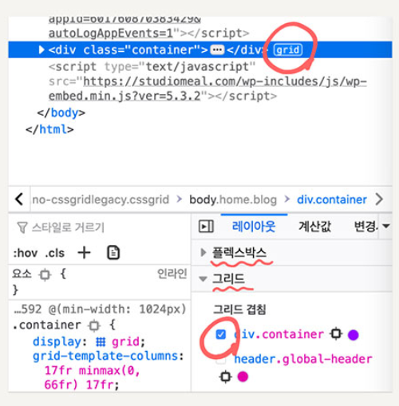
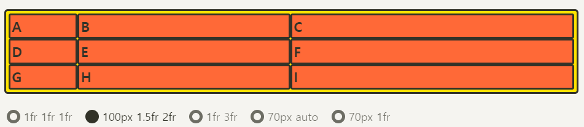
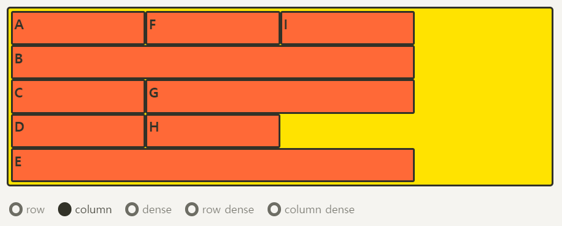
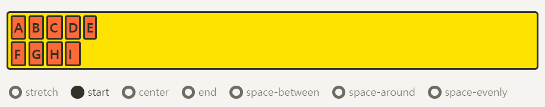
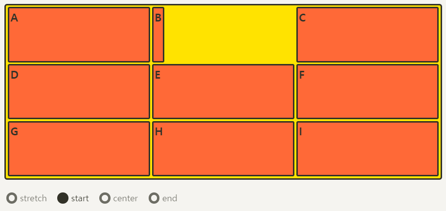

# CSS_Flex_Grid

>  **크롬 개발자 도구에 아래 기능 사용**
>
> 

[toc]

## Flex

> [CSS_Flex](https://studiomeal.com/archives/197)
>
>  Flexible Box, Flexbox 라고 부름
>
> 레이아웃 배치 전용 기능으로 고안됨
>
>  Grid로는 구현이 어려운 레이아웃이거나 Flex를 쓰는게 더 편리한 경우도 있다.
>
> 인터넷 익스플로러(IE)같은 경우는 Flex는 표준 스펙을 지원하지만 Grid는 legacy(고인물) 버전만 지원하기 때문에, 둘 다 잘 알아두고 적재적소에 활용하는 것이 가장 좋다

- 부모 요소인 div.container를 Flex Container(플렉스 컨테이너)라고 부르고, 자식 요소인 div.item들을 Flex Item(플렉스 아이템)이라고 부른다.


Flex의 속성들은, 두가지가 있다.

- 컨테이너에 적용하는 속성
- 아이템에 적용하는 속성

### **Flex 컨테이너에 적용하는 속성들**

#### 1) `display:flex;`

```css
.container {
	display: flex;
	/* display: inline-flex; */
}
```


- flex 적용 코드

```html
<!DOCTYPE html>
<html>
<head>
	<meta charset="UTF-8">
	<meta name="viewport" content="width=device-width, initial-scale=1.0">
	<meta http-equiv="X-UA-Compatible" content="ie=edge">
	<title>CSS Flex</title>
	<link rel="stylesheet" href="default.css">
	<style>
		.flex-container {
			display: flex;
			/* display: inline-flex; */
		}
	</style>
</head>
<body>
	<div class="flex-container">
		<div class="flex-item">AAAAAAAAAAAA</div>
		<div class="flex-item">BBB</div>
		<div class="flex-item">CCCCCCC</div>
	</div>
	Lorem ipsum dolor, sit amet consectetur adipisicing elit. Libero, facere.
</body>
</html>
```


#### 2) Float vs Flex

- Flex 아이템들은 가로 방향으로 배치되고, 자신이 가진 내용물의 width 만큼만 차지하게 된다. 마치 inline 요소들 처럼, height는 컨테이너의 높이만큼 늘어난다.


- 위 코드에 `inline-flex`를 처리하면 아래 처럼 된다.


#### 3) 메인축, 교차축

- 아이템들이 배치된 방향의 축을 **메인축**(Main Axis),
- 메인축과 수직인 축을 **수직축 또는 교차축**(Cross Axis)


#### 4) 배치 방향 설정 `flex-direction`

```css
.container {
	flex-direction: row;
	/* flex-direction: column; */
	/* flex-direction: row-reverse; */
	/* flex-direction: column-reverse; */
}
```


##### row (기본값)

아이템들이 행(가로) 방향으로 배치

##### row-reverse

아이템들이 역순으로 가로 배치

##### column

아이템들이 열(세로) 방향으로 배치

##### column-reverse

아이템들이 역순으로 세로 배치

#### 4) 줄넘김 처리 설정 `flex-wrap`

> 컨테이너가 더 이상 아이템들을 한 줄에 담을 여유 공간이 없을 때, 아이템 줄바꿈을 어떻게 할지 결정하는 속성.

```css
.container {
	flex-wrap: nowrap;
	/* flex-wrap: wrap; */
	/* flex-wrap: wrap-reverse; */
}
```


##### nowrap (기본값)

줄바꿈을 하지 않는다. 넘치면 그냥 밖으로 튀어 나간다.

##### wrap

줄바꿈을 한다. float이나 inline-block으로 배치한 요소들과 비슷하게 동작해요.

##### wrap-reverse

줄바꿈을 하는데, 아이템을 역순으로 배치

#### 5) flex-flow

> `flex-direction`과 `flex-wrap`을 한꺼번에 지정할 수 있는 단축 속성
> flex-direction, flex-wrap의 순으로 한 칸 떼고 쓰면 된다.

```css
.container {
	flex-flow: row wrap;
	/* 아래의 두 줄을 줄여 쓴 것 */
	/* flex-direction: row; */
	/* flex-wrap: wrap; */
}
```

#### 6) flex 반응형

```html
<!DOCTYPE html>
<html>
<head>
	<meta charset="UTF-8">
	<meta name="viewport" content="width=device-width, initial-scale=1.0">
	<meta http-equiv="X-UA-Compatible" content="ie=edge">
	<title>CSS Flex</title>
	<link rel="stylesheet" href="default.css">
	<style>
		.flex-container {
			display: flex;
			flex-direction: column;
		}
		/* 600 px 이상이 되면 flex-contianer를 row로 바꿔라 */
		@media (min-width: 600px) {
			.flex-container {
				flex-direction: row;
			}
			.flex-item {
				flex: 1;
			}
		}
	</style>
</head>
<body>
	<div class="flex-container">
		<div class="flex-item">AAAAAAAAAAAA</div>
		<div class="flex-item">BBB</div>
		<div class="flex-item">CCCCCCC</div>
	</div>
</body>
</html>
```

#### 7) flex 정렬

**“justify”는 메인축 방향으로 정렬, “align”은 수직축 방향으로 정렬**


#### 7) 메인축 방향 정렬 justify-content

justify 키워드가 나왔죠? 메인축 방향으로 아이템을들 정렬하는 속성이예요.

```
.container {
	justify-content: flex-start;
	/* justify-content: flex-end; */
	/* justify-content: center; */
	/* justify-content: space-between; */
	/* justify-content: space-around; */
	/* justify-content: space-evenly; */
}
```


##### flex-start (기본값)

아이템들을 시작점으로 정렬.
flex-direction이 row(가로 배치)일 때는 왼쪽, column(세로 배치)일 때는 위.

##### flex-end

아이템들을 끝점으로 정렬.
flex-direction이 row(가로 배치)일 때는 오른쪽, column(세로 배치)일 때는 아래.

##### center

아이템들을 가운데로 정렬.

##### space-between

아이템들의 “사이(between)”에 균일한 간격을 만들어줌.

##### space-around

아이템들의 “둘레(around)”에 균일한 간격을 만들어 줌.

##### space-evenly

아이템들의 사이와 양 끝에 균일한 간격을 만들어 준다.

> 주의! IE와 엣지(Edge)에서는 지원되지 않는다
> 이 웹사이트의 메뉴 부분은 브라우저 폭이 1024px 이상일 때 space-evenly가 적용되도록 했는데, IE와 엣지에서만 space-around로 적용이 됨.

##### space-between, space-around, space-evenly 차이


#### 8) 수직축 방향 정렬 align-items

align 키워드가 나왔죠? 수직축 방향으로 아이템을들 정렬하는 속성이예요.
justify-content와 수직 방향의 정렬이라고 생각하시면 됩니다.

```
.container {
	align-items: stretch;
	/* align-items: flex-start; */
	/* align-items: flex-end; */
	/* align-items: center; */
	/* align-items: baseline; */
}
```


##### stretch (기본값)

아이템들이 수직축 방향으로 끝까지 쭈욱 늘어남.

##### flex-start

아이템들을 시작점으로 정렬.
flex-direction이 row(가로 배치)일 때는 위, column(세로 배치)일 때는 왼쪽.

##### flex-end

아이템들을 끝으로 정렬.
flex-direction이 row(가로 배치)일 때는 위, column(세로 배치)일 때는 왼쪽.

##### center

아이템들을 가운데로 정렬

##### baseline

아이템들을 텍스트 베이스라인 기준으로 정렬


##### justify-content: center; align-item: center;


#### 9) 여러 행 정렬 align-content

flex-wrap: wrap;이 설정된 상태에서, 아이템들의 행이 2줄 이상 되었을 때의 수직축 방향 정렬을 결정하는 속성.

```css
.container {
	flex-wrap: wrap;
	align-content: stretch;
	/* align-content: flex-start; */
	/* align-content: flex-end; */
	/* align-content: center; */
	/* align-content: space-between; */
	/* align-content: space-around; */
	/* align-content: space-evenly; */
}
```


### **Flex 아이템에 적용하는 속성들**

#### 1) 유연한 박스의 기본 영역 flex-basis

flex-basis는 Flex 아이템의 기본 크기를 설정(flex-direction이 row일 때는 너비, column일 때는 높이).

```css
.item {
	flex-basis: auto; /* 기본값 */
	/* flex-basis: 0; */
	/* flex-basis: 50%; */
	/* flex-basis: 300px; */
	/* flex-basis: 10rem; */
	/* flex-basis: content; */
}
```

- flex-basis의 값으로는 우리가 width, height 등에 사용하는 각종 단위의 수가 들어갈 수 있고, 기본값 auto는 해당 아이템의 width값을 사용한다.

- width를 따로 설정하지 않으면 컨텐츠의 크기가 된다. content는 컨텐츠의 크기로, width를 따로 설정하지 않은 경우와 같다. 일단 지금은 아이템의 기본 점유 크기를 설정한다고 생각하면 된다.

```css
.item {
	flex-basis: 100px;
}
```

원래의 width가 100px이 안되는 AAA와 CCC는 100px로 늘어났고, 원래 100px이 넘는 BBB는 그대로 유지됨


반면에 width를 설정하면, 원래 100px을 넘는 BBB도 100px로 맞춰짐.

```css
.item {
	width: 100px;
}
```


둘 다 설정하면?

```css
.item {
	flex-basis: 100px;
	width: 100px;
}
```


#### 2) 유연하게 늘리기 flex-grow

flex-grow는 아이템이 flex-basis의 값보다 커질 수 있는지를 결정하는 속성
flex-grow에는 숫자값이 들어가는데, 일단 0보다 큰 값이 세팅이 되면 해당 아이템이 유연한(Flexible) 박스로 변하고 원래의 크기보다 커지며 빈 공간을 메우게 된다.
기본값이 0이기 때문에, 따로 적용하기 전까지는 아이템이 늘어나지 않는다.

```css
.item {
	flex-grow: 1;
	/* flex-grow: 0; */ /* 기본값 */
}
```


- flex-grow에 들어가는 숫자의 의미는, 아이템들의 flex-basis를 제외한 **여백** 부분을 **flex-grow에 지정된 숫자의 비율**로 나누어 가진다

```css
/* 1:2:1의 비율로 세팅할 경우 */
.item:nth-child(1) { flex-grow: 1; }
.item:nth-child(2) { flex-grow: 2; }
.item:nth-child(3) { flex-grow: 1; }
```


#### 3) 유연하게 줄이기 flex-shrink

- flex-shrink는 flex-grow와 쌍을 이루는 속성으로, 아이템이 flex-basis의 값보다 작아질 수 있는지를 결정.
- flex-shrink에는 숫자값이 들어가는데, 몇이든 일단 0보다 큰 값이 세팅이 되면 해당 아이템이 유연한(Flexible) 박스로 변하고 flex-basis보다 작아진다.
- 기본값이 1이기 때문에 따로 세팅하지 않았어도 아이템이 flex-basis보다 작아질 수 있다.

```css
.item {
	flex-basis: 150px;
	flex-shrink: 1; /* 기본값 */
}
```

- flex-shrink를 0으로 세팅하면 아이템의 크기가 flex-basis보다 작아지지 않기 때문에 고정폭의 컬럼을 쉽게 만들 수 있다. 고정 크기는 width로 설정.

```css
.container {
	display: flex;
}
.item:nth-child(1) {
	flex-shrink: 0; /*크기가 안줄어든다.*/
	width: 100px;
}
.item:nth-child(2) {
	flex-grow: 1;
}
```


#### 4) flex

**flex-grow, flex-shrink, flex-basis를 한 번에 쓸 수 있는 축약형 속성**
이 세 속성들은 서로 관련이 깊기 때문에, 이 축약형을 쓰는 편이 여러모로 편리하다.

```css
.item {
	flex: 1;
	/* flex-grow: 1; flex-shrink: 1; flex-basis: 0%; */
	flex: 1 1 auto;
	/* flex-grow: 1; flex-shrink: 1; flex-basis: auto; */
	flex: 1 500px;
	/* flex-grow: 1; flex-shrink: 1; flex-basis: 500px; */
}
```

주의할 점은, flex: 1; 이런 식으로 flex-basis를 생략해서 쓰면 flex-basis의 값은 0이 된다.

```css
.item {
	flex: 1 1 0;
}
.item:nth-child(2) {
	flex: 2 1 0;
}
```


`flex-basis: 0;` 으로, 기본 점유 크기를 0으로 만들어버려 결국 전체 크기를 1:2:1로 나누어 가져서, 영역 자체의 크기가 정확히 1:2:1의 비율로 설정된다.
여백의 비가 아닌, 영역 자체를 원하는 비율로 분할하기를 원한다면 이렇게 flex-basis을 0으로 하면 손쉽게 처리할 수 있다.

```css
.container {
	display: flex;
	flex-wrap: wrap;
}
.item {
	flex: 1 1 40%;
}
```

flex-basis가 40%면, 100%에는 2개까지만 들어가므로 하나의 row에는 2개까지만 남고 다음줄로 넘어가게 되어서 2단 컬럼이 유지가 된다.


**Flex보다 정확한 비율로 컬럼을 나누기 위해선 width가 안전하다.(Flex는 강제로 압축시키지 않고 안의 내용이 많아지면 그냥 빠져나온다.)**

#### flex cloumn 반응형

> `flex-basis:auto;`는 내가 설정한 width가 있다면 그 값이 들어온다.
>
> ```css
> .flex-item {
> 				width: 50%;
> 				flex-basis: auto;
> 			}
> ```
>
> 이렇게 설정하면 auto는 50%가 된다.

```html
<!DOCTYPE html>
<html>
<head>
	<meta charset="UTF-8">
	<meta name="viewport" content="width=device-width, initial-scale=1.0">
	<meta http-equiv="X-UA-Compatible" content="ie=edge">
	<title>CSS Flex</title>
	<link rel="stylesheet" href="default.css">
	<style>
		.flex-container {
			display: flex;
			flex-direction: column;
			min-height: 100vh; /*최소를 해주면 보더가 잘리지 않는다.*/
			/* border: 10px solid red; */
		}
		.flex-item {
			flex: 1 auto;
		}
        /* 600px 이상에는 2단!*/
		@media (min-width: 600px) {
			.flex-container {
				flex-direction: row;
				flex-wrap: wrap;
			}
			.flex-item {
				width: 50%;
				/* flex-grow: 0; */
				/* flex: 0 auto; */
				/* flex-basis: 50%; */
			}
		}
        /*900px이상 3단*/
		@media (min-width: 900px) {
			.flex-item {
				width: 30%;
			}
		}
	</style>
</head>
<body>
	<div class="flex-container">
		<div class="flex-item">AAAAAAAAAA</div>
		<div class="flex-item">BB</div>
		<div class="flex-item">CCCCCC</div>
		<div class="flex-item">AAAAAAAAAA</div>
		<div class="flex-item">BB</div>
		<div class="flex-item">CCCCCC</div>
		<div class="flex-item">AAAAAAAAAA</div>
		<div class="flex-item">BB</div>
		<div class="flex-item">CCCCCC</div>
	</div>
</body>
</html>
```


#### IE버그

> 인터넷 익스플로어에는 `min-height`가 잘 먹지 않는다.
>
> ```css
> .page {
>     display: flex;
>     flex-direction: column;
>     min-height: 100vh;
> }
> .content {
>     flex: 1 auto;
>     padding:1.5rem;
> }
> 
> /* IE에서는 이렇게 변경 */
> .page {
>     display: flex;
>     flex-direction: column;
>     height: 100vh;
> }
> .content {
>     overflow: auto;
>     flex: 1 auto;
>     padding:1.5rem;
> }
> ```

#### 5) 수직축으로 아이템 정렬 align-self

align이니 수직축 정렬
align-items의 아이템 버전 `align-items`가 전체 아이템의 수직축 방향 정렬이라면, `align-self`는 해당 아이템의 수직축 방향 정렬.

```css
.item {
	align-self: auto;
	/* align-self: stretch; */
	/* align-self: flex-start; */
	/* align-self: flex-end; */
	/* align-self: center; */
	/* align-self: baseline; */
}
```

기본값은 `auto`로, 기본적으로 ` align-items` 설정을 상속 받는다.
align-self는 align-items보다 우선권이 있다

전체 설정보다 각각의 개별 설정이 우선한다는 것
auto외의 나머지 값들은 align-items와 동일하다.

**아래는 align-self 값을 BBB는 center, CCC는 flex-start로 설정한 예시**


#### 6) 배치 순서 order

각 아이템들의 시각적 나열 순서를 결정하는 속성.
숫자값이 들어가며, 작은 숫자일 수록 먼저 배치된다. **“시각적” **순서일 뿐, HTML 자체의 구조를 바꾸는 것은 아니므로 접근성 측면에서 사용에 주의해야 된다. 시각 장애인분들이 사용하는 스크린 리더로 화면을 읽을 때, order를 이용해 순서를 바꾼 것은 의미가 없다.

```css
.item:nth-child(1) { order: 3; } /* A */
.item:nth-child(2) { order: 1; } /* B */
.item:nth-child(3) { order: 2; } /* C */
```


#### 7) z-index

z-index로 Z축 정렬을 할 수 있다. 숫자가 클 수록 위로 올라온다.
(position에서의 z-index랑 똑같이 생각하시면 된다.)

```css
.item:nth-child(2) {
	z-index: 1;
	transform: scale(2);
}
/* z-index를 설정 안하면 0이므로, 1만 설정해도 나머지 아이템을 보다 위로 올라온다 */
```


### Flex UI 메뉴

> 

- `menu.html`

```html
<!DOCTYPE html>
<html>
<head>
	<meta charset="UTF-8">
	<meta name="viewport" content="width=device-width, initial-scale=1.0">
	<meta http-equiv="X-UA-Compatible" content="ie=edge">
	<title>CSS Flex</title>
	<link rel="stylesheet" href="default.css">
	<link rel="stylesheet" href="ui.css">
</head>
<body>
	<ul class="menu">
		<li class="menu-item">
			<a href="#" class="menu-link">Home</a>
		</li>
		<li class="menu-item">
			<a href="#" class="menu-link">About</a>
		</li>
		<li class="menu-item">
			<a href="#" class="menu-link">Product</a>
		</li>
		<li class="menu-item">
			<a href="#" class="menu-link">Contact</a>
		</li>
	</ul>
</body>
</html>
```

- `ui.css`

```css
/* menu */
.menu {
	display: flex;
}
.menu-item {
	/* flex-grow: 1; */ /* width로 하는게 좋다. 왜냐면 IE에서는 flex-grow에 애니메이션 처리가 안먹는다. */
	width: 25%;
	background: gold;
	transition: 0.5s; /* 애니메이션 */
}
.menu-item:hover {
	/* flex-grow: 1.5; */
	width: 35%;
	background: crimson;
}
.menu-link {
	/* a 태그는 인라인이기 때문에 block으로 바꿔 해당 칸 모두 어디든 클릭 할 수 있게 만듦 */
	display: block; 
	padding: 1em; /* 현재 내 폰트사이즈만큼(1.2rem) 패딩을 준단 말  */
	font-size: 1.2rem; /* html 폰트사이즈의 1.2배 */
	font-weight: bold;
	color: #555;
	text-decoration: none; /* 밑줄 없앰 */
	text-align: center;
}
.menu-link:hover {
	color: white;
}

```


### Flex UI 유연한 검색창

> 

- `search.html`

```html
<!DOCTYPE html>
<html>
<head>
	<meta charset="UTF-8">
	<meta name="viewport" content="width=device-width, initial-scale=1.0">
	<meta http-equiv="X-UA-Compatible" content="ie=edge">
	<title>CSS Flex</title>
	<link rel="stylesheet" href="default.css">
	<link rel="stylesheet" href="ui.css">
</head>
<body>
	<form class="search-form">
		<input type="search">
		<input type="submit" value="찾기">
	</form>
</body>
</html>
```

- `ui.css`

```css
/* search */
.search-form {
	display: flex;
	height: 40px;
}
.search-form input[type="search"] {
	flex: 1; /* 창의 크기에 따라 늘어날 수 있게 지정 */
	min-width: 0;
	margin-right: 10px;
	border: 0;
	border-radius: 0.3em;
	font-size: 1rem;
}
.search-form input[type="submit"] {
	width: 4em;
	border: 0;
	border-radius: 0.3em;
	font-size: 1rem;
	background: gold;
}
```


### Flex UI 불릿 리스트

> 
>
> [copychar.cc](https://copychar.cc/)에서 bullet 이미지 가져오기

- `bullet.html`

```html
<!DOCTYPE html>
<html>
<head>
	<meta charset="UTF-8">
	<meta name="viewport" content="width=device-width, initial-scale=1.0">
	<meta http-equiv="X-UA-Compatible" content="ie=edge">
	<title>CSS Flex</title>
	<link rel="stylesheet" href="default.css">
	<link rel="stylesheet" href="ui.css">
</head>
<body>
	<ul class="info-list">
		<li class="info-list-item">
			Lorem ipsum dolor sit amet consectetur adipisicing elit. Nihil fugit numquam aspernatur excepturi, eos soluta praesentium maiores commodi minus accusantium?
		</li>
		<li class="info-list-item">
			Lorem ipsum dolor, sit amet consectetur adipisicing elit. Ipsam tempora nisi unde corrupti dicta.
		</li>
		<li class="info-list-item">
			Lorem ipsum dolor sit amet consectetur adipisicing elit. Ullam consequatur alias, ducimus ea magnam nostrum repudiandae repellendus deleniti veniam? Assumenda expedita ad eum nihil!
		</li>
	</ul>
</body>
</html>
```

- `ui.css`

```css
/* bullet list */
.info-list {
	margin-bottom: 2rem;
}
.info-list-item {
	display: flex;
	margin: 0.5em 0;
}
/* 가상 element before 사용 */
.info-list-item:before {
	content: "⌘";
	margin-right: 0.5em;
}
```


### Flex UI 메시지 리스트

> 

- `message.html`

> 프로필 이미지 `figure`태그의 `backgroud`이미지를 이용하면 어떤 크기의 프로필 사진이 들어오든 관리하기가 쉽다.

```html
<!DOCTYPE html>
<html>
<head>
	<meta charset="UTF-8">
	<meta name="viewport" content="width=device-width, initial-scale=1.0">
	<meta http-equiv="X-UA-Compatible" content="ie=edge">
	<title>CSS Flex</title>
	<link rel="stylesheet" href="default.css">
	<link rel="stylesheet" href="ui.css">
</head>
<body>
	<ul class="user-list message-list">
		<li class="user-item message-item">
			<figure class="user-photo" style="background-image: url(images/ilbuni.png);"></figure>
			<p class="message-content">
				Lorem ipsum dolor sit amet consectetur adipisicing elit. Iure nobis, nisi numquam harum voluptates vel corrupti dolorem id, dicta eveniet similique architecto et, exercitationem quaerat alias ratione. Dicta, beatae, aspernatur, sit commodi quis illo non aut repellendus veritatis at ab.
			</p>
		</li>
		<li class="user-item message-item">
			<figure class="user-photo" style="background-image: url(images/ilbuni.png);"></figure>
			<p class="message-content">
				Lorem ipsum dolor sit amet consectetur adipisicing elit. Iure nobis, nisi numquam harum voluptates vel corrupti dolorem id, dicta eveniet similique architecto et, exercitationem quaerat alias ratione.
			</p>
		</li>
		<li class="user-item message-item">
			<figure class="user-photo" style="background-image: url(images/ilbuni.png);"></figure>
			<p class="message-content">
				Lorem ipsum dolor sit amet consectetur adipisicing elit. Iure nobis, nisi numquam harum voluptates vel corrupti dolorem id.
			</p>
		</li>
	</ul>
</body>
</html>
```

- `ui.css`

```css
/* message */
.user-list {
	margin-bottom: 2rem;
}
.user-item {
	display: flex;
	margin-bottom: 1.5em; /* em은 폰트사이즈에 따라 달라지고, rem은 root(html)의 폰트사이즈에 따라 달라짐 */
}
.user-photo {
	/* 메세지가 아무리 길더라도 프로필 사진이 안찌그러지게 함 
	flex-shrink로 강제로 안 줄어들게 하려면 0으로 설정
	*/
	flex-shrink: 0;
	width: 50px;
	height: 50px;
	margin-right: 0.5em;
	border: 2px solid #333;
	border-radius: 50%; /* 원모양의 border */
	background-color: gold;
	background-repeat: no-repeat;
	background-position: center;
	background-size: 150%; /* 원 안에 다 들어가야 되기 때문에 크기를 키워줌 */
}
```


### Flex UI 유저리스트

> 

- `user.html`

```html
<!DOCTYPE html>
<html>
<head>
	<meta charset="UTF-8">
	<meta name="viewport" content="width=device-width, initial-scale=1.0">
	<meta http-equiv="X-UA-Compatible" content="ie=edge">
	<title>CSS Flex</title>
	<link rel="stylesheet" href="default.css">
	<link rel="stylesheet" href="ui.css">
</head>
<body>
	<ul class="user-list friend-list">
		<li class="user-item friend-item">
			<figure class="user-photo" style="background-image: url(images/ilbuni.png);"></figure>
			<p class="user-name">
				일분이 일분이 일분이 일분이 일분이 일분이 일분이 일분이 일분이 일분이 일분이 일분이 일분이 일분이 일분이 일분이
			</p>
		</li>
		<li class="user-item friend-item">
			<figure class="user-photo" style="background-image: url(images/ilbuni.png);"></figure>
			<p class="user-name">
				일분이 일분이 일분이 일분이 일분이 일분이 일분이 일분이
			</p>
		</li>
		<li class="user-item friend-item">
			<figure class="user-photo" style="background-image: url(images/ilbuni.png);"></figure>
			<p class="user-name">
				일분이 일분이 일분이 일분이 일분이 일분이 일분이 일분이
			</p>
		</li>
	</ul>
</body>
</html>
```

- `ui.css`

```css
/* friend list */
.friend-item {
	align-items: center;
}
/* 이 세가지 속성을 쓰면 길어졌을 때 말줄임표가 생김 */
.user-name {
	overflow: hidden;
	text-overflow: ellipsis;
	white-space: nowrap;
}
```


### Flex UI 모달

> 

- `modal.html`

```html
<!DOCTYPE html>
<html>
<head>
	<meta charset="UTF-8">
	<meta name="viewport" content="width=device-width, initial-scale=1.0">
	<meta http-equiv="X-UA-Compatible" content="ie=edge">
	<title>CSS Flex</title>
	<link rel="stylesheet" href="default.css">
	<link rel="stylesheet" href="ui.css">
</head>
<body>
	<div class="modal">
		<div class="dialog">
			Lorem ipsum dolor sit amet consectetur adipisicing elit. Atque exercitationem odio, modi laboriosam a perspiciatis est delectus quisquam obcaecati vel eos natus ipsam quasi reprehenderit nihil eligendi quam aliquid! Totam vitae quis, obcaecati quos, ut aut eveniet architecto sed harum ea deleniti itaque saepe unde nulla?
		</div>
	</div>
</body>
</html>
```

- `ui.css`

```css
/* modal */
.modal {
	/* 가운데 위치시킴 */
	display: flex;
	justify-content: center;
	align-items: center;
	position: fixed;
	left: 0;
	right: 0;
	top: 0;
	bottom: 0;
	background: rgba(0, 0, 0, 0.3);
}
.dialog {
	width: 50vw;
	padding: 2em;
	border-radius: 1em;
	background: white;
}
```


### Flex UI 카드리스트

> **카드 리스트의 이미지는 일반적으로 DB에 있는 이미지를 불러오기 때문에 인라인 CSS로 넣는 것이 합리적**
>
> 
>
> 
>
> 

- `card-list.html`

```html
<!DOCTYPE html>
<html>
<head>
	<meta charset="UTF-8">
	<meta name="viewport" content="width=device-width, initial-scale=1.0">
	<meta http-equiv="X-UA-Compatible" content="ie=edge">
	<title>CSS Flex</title>
	<link rel="stylesheet" href="default.css">
	<link rel="stylesheet" href="ui.css">
</head>
<body>
	<div class="card-list-con">
    	<ul class="card-list">
    		<li class="card-item">
    			<figure class="card-image" style="background-image: url(images/ilbuni.png)">
    				
    			</figure>
    			<div class="card-desc">
    				Lorem ipsum dolor sit, amet consectetur adipisicing elit. Hic, perferendis? dolor sit, amet consectetur adipisicing elit. Hic, perferendis?
    			</div>
    		</li>
    		<li class="card-item">
    			<figure class="card-image" style="background-image: url(images/ilbuni.png)">
    				
    			</figure>
    			<div class="card-desc">
    				Lorem ipsum.
    			</div>
    		</li>
    		<li class="card-item">
    			<figure class="card-image" style="background-image: url(images/ilbuni.png)">
    				
    			</figure>
    			<div class="card-desc">
    				Lorem ipsum dolor sit amet consectetur adipisicing elit. Enim impedit odio expedita pariatur architecto molestias recusandae quam distinctio! Nemo sapiente laborum fugit adipisci reiciendis eos in eveniet dicta iure unde vel beatae nihil sit necessitatibus similique perspiciatis saepe aperiam, expedita laudantium consequatur? Blanditiis, rem exercitationem. Exercitationem odio aliquam distinctio unde?
    			</div>
    		</li>
    		<li class="card-item">
    			<figure class="card-image" style="background-image: url(images/ilbuni.png)">
    				
    			</figure>
    			<div class="card-desc">
    				Lorem ipsum dolor sit, amet consectetur adipisicing elit. Hic, perferendis?
    			</div>
    		</li>
    		<li class="card-item">
    			<figure class="card-image" style="background-image: url(images/ilbuni.png)">
    				
    			</figure>
    			<div class="card-desc">
    				Lorem ipsum dolor sit, amet consectetur adipisicing elit. Hic, perferendis?
    			</div>
    		</li>
    		<li class="card-item">
    			<figure class="card-image" style="background-image: url(images/ilbuni.png)">
    				
    			</figure>
    			<div class="card-desc">
    				Lorem ipsum dolor sit, amet consectetur adipisicing elit. Hic, perferendis?
    			</div>
    		</li>
    		<li class="card-item">
    			<figure class="card-image" style="background-image: url(images/ilbuni.png)">
    				
    			</figure>
    			<div class="card-desc">
    				Lorem ipsum dolor sit, amet consectetur adipisicing elit. Hic, perferendis?
    			</div>
    		</li>
    		<li class="card-item">
    			<figure class="card-image" style="background-image: url(images/ilbuni.png)">
    				
    			</figure>
    			<div class="card-desc">
    				Lorem ipsum dolor sit, amet consectetur adipisicing elit. Hic, perferendis?
    			</div>
    		</li>
    	</ul>
	</div>
</body>
</html>

```

- `ui.css`

```css
/* card list */
.card-item {
	display: flex;
	/* flex grow가 높이로 늘어나려면 column으로 설정해야됨 */
	flex-direction: column;
	margin-bottom: 2rem;
}
.card-image {
	height: 0;
	padding-bottom: 60%; /* height를 주는것이 아니라 패딩을 60%로 줘서 가로가 100이라면 높이는 60%가 돼서 backgroud-img의 크기를 확보해줌, 가로 세로 비율이 유지됨 */
	background-color: lightgray;
	background-repeat: no-repeat;
	background-position: center;
	background-size: cover; /* 컨테이너에 꽉 맞게 됨 */
}
.card-image img {
	display: none; /* figure 태그의 backgroud 이미지로 주기 위해 img는 안보이게 함 */
}
.card-desc {
	/* flex-grow 1 flex-shrink 1 flex-basis auto
	컨텐츠 길이가 얼마든 알아서 늘어나게(flex-grow) auto로 주면 desc 길이에 맞게 전체적으로 크기가 맞게 늘어남 */
	flex: 1 1 auto;
	padding: 1em;
	background: white;
}
/* 600px 이상일때 */
@media (min-width: 600px) {
	.card-list-con {
		overflow-x: hidden;
	}
	.card-list {
		display: flex;
		/* 절반 차지하고, 넘치면 아래로 떨어지게 만듦 */
		flex-wrap: wrap;
		/* 패딩을 1rem준만큼 -1rem 주면 여백없이 꽉 차게됨 */
		margin: 0 -1rem;
	}
	.card-item {
		/* 두개씩 하게하려면 절반을 차지하게함 */
		width: 50%;
		/* 좌우에 패딩을 줌 */
		padding: 0 1rem;
	}
}
/* 1200px이상 */
@media (min-width: 1200px) {
	.card-item {
		/* 3개씩 위치하게 함 */
		width: 33.33333%;
	}
}
```

### Flex UI 반응형페이지

> 골격을 나눔
>
> 
>
> 
>
> 
>
> 
>
> 

```html
<!DOCTYPE html>
<html>
<head>
	<meta charset="UTF-8">
	<meta name="viewport" content="width=device-width, initial-scale=1.0">
	<meta http-equiv="X-UA-Compatible" content="ie=edge">
	<title>CSS Flex</title>
	<link rel="stylesheet" href="default.css">
	<link rel="stylesheet" href="ui.css">
	<link rel="stylesheet" href="ui-page.css">
</head>
<body>
	<div class="page">
		<!-- header -->
		<header class="header">
			<h1 class="website-title">1분코딩</h1>
			<form class="search-form">
				<input type="search">
				<input type="submit" value="찾기">
			</form>
			<!-- <div id="modal-switch">⚑</div> -->
		</header>

		<!-- menu -->
		<ul class="menu">
			<li class="menu-item">
				<a href="#" class="menu-link">Home</a>
			</li>
			<li class="menu-item">
				<a href="#" class="menu-link">About</a>
			</li>
			<li class="menu-item">
				<a href="#" class="menu-link">Product</a>
			</li>
			<li class="menu-item">
				<a href="#" class="menu-link">Contact</a>
			</li>
		</ul>

		<!-- <div class="content-container"> -->
		<!-- primary -->
		<section class="primary">
			<ul class="card-list">
				<li class="card-item">
					<figure class="card-image" style="background-image: url(images/ilbuni.png)">
						
					</figure>
					<div class="card-desc">
						Lorem ipsum dolor sit amet consectetur adipisicing elit. Sit libero in ratione dicta nihil corporis illo odio, voluptatem a nam!
					</div>
				</li>
				<li class="card-item">
					<figure class="card-image"></figure>
					<div class="card-desc">
						Lorem ipsum.
					</div>
				</li>
				<li class="card-item">
					<figure class="card-image"></figure>
					<div class="card-desc">
						Lorem ipsum dolor sit amet consectetur adipisicing elit. Sit libero in ratione dicta nihil corporis illo odio, voluptatem a nam! Lorem ipsum dolor sit amet consectetur adipisicing elit. Sit libero in ratione dicta nihil corporis illo odio, voluptatem a nam!
					</div>
				</li>
				<li class="card-item">
					<figure class="card-image"></figure>
					<div class="card-desc">
						Lorem ipsum dolor sit amet consectetur adipisicing elit. Sit libero in ratione dicta nihil corporis illo odio, voluptatem a nam!
					</div>
				</li>
				<li class="card-item">
					<figure class="card-image"></figure>
					<div class="card-desc">
						Lorem ipsum dolor sit amet consectetur adipisicing elit. Sit libero in ratione dicta nihil corporis illo odio, voluptatem a nam!
					</div>
				</li>
				<li class="card-item">
					<figure class="card-image"></figure>
					<div class="card-desc">
						Lorem ipsum dolor sit amet consectetur adipisicing elit. Sit libero in ratione dicta nihil corporis illo odio, voluptatem a nam!
					</div>
				</li>
				<li class="card-item">
					<figure class="card-image"></figure>
					<div class="card-desc">
						Lorem ipsum dolor sit amet consectetur adipisicing elit. Sit libero in ratione dicta nihil corporis illo odio, voluptatem a nam!
					</div>
				</li>
				<li class="card-item">
					<figure class="card-image"></figure>
					<div class="card-desc">
						Lorem ipsum dolor sit amet consectetur adipisicing elit. Sit libero in ratione dicta nihil corporis illo odio, voluptatem a nam!
					</div>
				</li>
			</ul>
		</section>

		<!-- secondary-a -->
		<aside class="secondary secondary-a">
			<ul class="info-list">
				<li class="info-list-item">
					Lorem ipsum dolor sit amet consectetur adipisicing elit. Nihil fugit numquam aspernatur excepturi, eos soluta praesentium maiores commodi minus accusantium?
				</li>
				<li class="info-list-item">
					Lorem ipsum dolor, sit amet consectetur adipisicing elit. Ipsam tempora nisi unde corrupti dicta.
				</li>
				<li class="info-list-item">
					Lorem ipsum dolor sit amet consectetur adipisicing elit. Ullam consequatur alias, ducimus ea magnam nostrum repudiandae repellendus deleniti veniam? Assumenda expedita ad eum nihil!
				</li>
			</ul>

			<ul class="user-list friend-list">
				<li class="user-item friend-item">
					<figure class="user-photo" style="background-image: url(images/ilbuni.png);"></figure>
					<p class="user-name">
						일분이 일분이 일분이 일분이 일분이 일분이 일분이 일분이 일분이 일분이 일분이 일분이 일분이 일분이 일분이 일분이
					</p>
				</li>
				<li class="user-item friend-item">
					<figure class="user-photo" style="background-image: url(images/ilbuni.png);"></figure>
					<p class="user-name">
						일분이 일분이 일분이 일분이 일분이 일분이 일분이 일분이
					</p>
				</li>
				<li class="user-item friend-item">
					<figure class="user-photo" style="background-image: url(images/ilbuni.png);"></figure>
					<p class="user-name">
						일분이 일분이 일분이 일분이 일분이 일분이 일분이 일분이
					</p>
				</li>
			</ul>
		</aside>

		<!-- secondary-b -->
		<aside class="secondary secondary-b">
			<ul class="user-list message-list">
				<li class="user-item message-item">
					<figure class="user-photo" style="background-image: url(images/ilbuni.png);"></figure>
					<p class="message-content">
						Lorem ipsum dolor sit amet consectetur adipisicing elit. Iure nobis, nisi numquam harum voluptates vel corrupti dolorem id, dicta eveniet similique architecto et, exercitationem quaerat alias ratione. Dicta, beatae, aspernatur, sit commodi quis illo non aut repellendus veritatis at ab.
					</p>
				</li>
				<li class="user-item message-item">
					<figure class="user-photo" style="background-image: url(images/ilbuni.png);"></figure>
					<p class="message-content">
						Lorem ipsum dolor sit amet consectetur adipisicing elit. Iure nobis, nisi numquam harum voluptates vel corrupti dolorem id, dicta eveniet similique architecto et, exercitationem quaerat alias ratione.
					</p>
				</li>
				<li class="user-item message-item">
					<figure class="user-photo" style="background-image: url(images/ilbuni.png);"></figure>
					<p class="message-content">
						Lorem ipsum dolor sit amet consectetur adipisicing elit. Iure nobis, nisi numquam harum voluptates vel corrupti dolorem id.
					</p>
				</li>
			</ul>
		</aside>
		<!-- </div> -->

		<!-- footer -->
		<footer class="footer">
			Lorem ipsum dolor sit amet.
		</footer>
	</div>

	<input type="checkbox" id="modal-switch">
	<label for="modal-switch">
		<span>modal 열고 닫기</span>
	</label>
	
	<div class="modal">
		<div class="dialog">
			Lorem ipsum dolor sit amet consectetur adipisicing elit. Atque exercitationem odio, modi laboriosam a perspiciatis est delectus quisquam obcaecati vel eos natus ipsam quasi reprehenderit nihil eligendi quam aliquid! Totam vitae quis, obcaecati quos, ut aut eveniet architecto sed harum ea deleniti itaque saepe unde nulla?
		</div>
	</div>
</body>
</html>
```

- `ui-page.css`

```css
.header	{
	display: flex;
	align-items: center;
	/* justify-content: space-between; */
	height: 80px;
	padding: 0 1rem;
}
/* search-form 크기에 맞게 search의 input의 크기가 바뀜 */
.search-form {
	width: 300px;
	/* 크기를 제한시킴 */
	max-width: 60%;
/* .header에 justify-content: space-between; 대신 사용 가능 */
/* 왼쪽을 다 씀 */
	margin-left: auto;
	/* 깃발모양이 들어올 것이기 때문에 공간을 줌 */
	margin-right: 3rem;
}
.primary {
	/* 헤더랑 맞춰서 1rem으로 해줌 */
	padding: 1rem;
}
.secondary {
	/* 헤더랑 맞춰서 1rem으로 해줌 */
	padding: 1rem;
}
.secondary-a {
	background: white;
}
.secondary-b {
	color: white;
	background: #666;
}
.footer {
	/* 헤더랑 맞춰서 1rem으로 해줌 */
	padding: 1rem;
	border-top: 1px solid lightgray;
	text-align: center;
}
/* modal 클릭 했을 때만 보이게 CSS로 처리 */
.modal {
	display: none;
	/* 모달이 헤더를 가리지 않게 위치를 맞게 해줌 */
	top: 80px;
}
/* 
"~" : modal-switch input이 체크된 상태에 다음에 나오는 형제(같은 레벨)의 밑에 있는 클래스가 modal인 것 모두 적용됨

"+" : 체크된 상태의 같은레벨의 바로 아래 클래스가 modal인 것 1개만 적용
*/
#modal-switch:checked ~ .modal {
	display: flex;
}
/* label의 for이 "modal-switch"인 것 */
/* 깃발모양을 위로 올리기 위해 absolute */
label[for="modal-switch"] {
	/* 버튼이니 inline-flex로 하면 더 일반적이다. */
	display: flex;
	align-items: center;
	justify-content: center;
	position: absolute;
	top: 1.3rem;
	right: 1rem;
	/* z-index: 100; */
	width: 40px;
	height: 40px;
	cursor: pointer;
	/* background: red; */
}
/* label의 for이 "modal-switch"인 것 가상 엘리먼트 */
label[for="modal-switch"]:before {
	content: "⚑";
	font-size: 2rem;
	cursor: pointer;
}
/* 깃발이 체크 됐을 때 색으로 바꿔줌 */
#modal-switch:checked ~ label[for="modal-switch"]:before {
	color: dodgerblue;
}
#modal-switch,
label[for="modal-switch"] span {
	/* 스크린리더, SEO등의 이유로 display:none;이나 width:0;등의 사용을 피함 */
	overflow: hidden;
	position: absolute;
	top: 0; /* 크롬에서는 모달이 하단에 위치하는 문제가 있어서 적어줘야됨! */
	width: 1px;
	height: 1px;
	opacity: 0;
}

/* 반응형 */
/* 최소 폭이 1024(ipad) */
@media (min-width: 1024px) {
	.page {
		display: flex;
		/* flex item이 컨테이너를 벗어나면 아래로 떨어짐 */
		flex-wrap: wrap;
	}
	.header {
		/* 한줄을 차지해야됨 */
		width: 100%;
	}
	.menu {
		/* 한줄을 차지해야됨 */
		width: 100%;
	}
	/* flex-grow보다 width를 사용하는게 더 정확	*/
	/* 양옆이 20%씩 2개라 primary는 60% */
	.primary {
		/* order가 작은게 더 먼저옴 */
		order: 2;
		width: 60%;
	}
	/* 양옆을 각각 20%로 해줌 */
	.secondary {
		width: 20%;
	}
	.secondary-a {
		order: 1;
	}
	.secondary-b {
		order: 3;
	}
	.footer {
		/* 헤더나 menu는 어차피 앞에 있는 것들이라 따로 order를 안줘도 되고, footer도 flex-item이기 떄문에 order를 위에는 다 줬는데 이건 안주면 order:0;이기 때문에 가장 크게 order를 줘야 제일 뒷순서가 된다. */
		order: 4;
		/* 한줄을 차지해야됨 */
		width: 100%;
	}
}

@media (min-width: 1400px) {
	.primary {
		/* 양쪽 600px이니까 전체에서 600px만큼 빼줌 "꼭 띄어쓰기를 해야 적용된다" */
		/* 1번 방법 */
		width: calc(100% - 600px);
		/* width말고도 아래의 방법도 있다. 근데 width를 쓴것 보다 확실하게 적용되지 않는다. 칼럼은 보통 픽스된 정해진 레이아웃이 있으면 width를 쓰는 것이 더 안전하다 */
		/* 2번 방법 */
		/* flex-grow: 1; */
		/* flex: 1 1 auto; */
		/* flex: auto; */
	}
	/* 일정 크기가 지나면 300px로 고정 */
	.secondary {
		width: 300px;
	}
}
```


## Grid

> [CSS Grid](https://studiomeal.com/archives/533)
>
> **Flex보다 더 복합적인 레이아웃 표현이 가능**
>
> 

Grid 레이아웃을 만들기 위한 기본적인 HTML 구조는 다음과 같다.
Flex와 마찬가지로, 컨테이너와 아이템이 있으면 된다.

```html
<div class="container">
	<div class="item">A</div>
	<div class="item">B</div>
	<div class="item">C</div>
	<div class="item">D</div>
	<div class="item">E</div>
	<div class="item">F</div>
	<div class="item">G</div>
	<div class="item">H</div>
	<div class="item">I</div>
</div>
```

부모 요소인 div.container를 **Grid Container(그리드 컨테이너)**라고 부르고,
자식 요소인 div.item들을 **Grid Item(그리드 아이템)**이라고 부른다.
“컨테이너가 Grid의 영향을 받는 전체 공간이고, 설정된 속성에 따라 각각의 아이템들이 어떤 형태로 배치되는 것”

Flex와 마찬가지로, Grid는 컨테이너에 display: grid; 를 설정하는 것으로 시작

```css
.container {
	display: grid;
}
```

### Grid 용어


- **그리드 컨테이너 (Grid Container)**
  	- `display: grid`를 적용하는, Grid의 전체 영역
  - Grid 컨테이너 안의 요소들이 Grid 규칙의 영향을 받아 정렬됨
  - 위 코드 `<div class="container"></div>`가 Grid 컨테이너.
- **그리드 아이템 (Grid** **Item)**
  - Grid 컨테이너의 자식 요소들
  - 바로 이 아이템들이 Grid 규칙에 의해 배치됨
  - 위 코드에서 `<div class="item"></div>`들이 Grid 아이템
- **그리드 트랙 (Grid Track)**
  - Grid의 행(Row) 또는 열(Column)
- **그리드 셀 (Grid Cell)**
  - Grid의 한 칸을 가리키는 말.
  - ` <div>`같은 실제 html 요소는 그리드 아이템이고, 이런 Grid 아이템 하나가 들어가는 “가상의 칸(틀)”.
- **그리드 라인(Grid Line)**
  - Grid 셀을 구분하는 선
- **그리드 번호(Grid Number)**
  - Grid 라인의 각 번호
- **그리드 갭(Grid Gap)**
  - Grid 셀 사이의 간격
- **그리드 영역(Grid Area)**
  - Grid 라인으로 둘러싸인 사각형 영역으로, 그리드 셀의 집합

Grid의 속성들은 Flex와 마찬가지로,

- 컨테이너에 적용하는 속성
- 아이템에 적용하는 속성

이렇게 두 가지로 나뉨


### display: grid;

Grid 컨테이너에 display: grid;를 적용하는게 시작
아이템들이 block 요소라면 이 한 줄 만으로는 딱히 변화는 없다.

```css
.container {
	display: grid;
	/* display: inline-grid; */
}
/* 그리고 아무 일도 일어나지 않았다 */
```

**inline-grid**도 있는데, 이건 block과 inline-block의 관계를 생각하면 된다.
아이템의 배치와 관련이 있다기 보다는, 컨테이너가 주변 요소들과 어떻게 어우러질지 결정하는 값 inline-grid는 inline-block처럼 동작

### 그리드 형태 정의 

### `grid-template-rows` 

### `grid-template-columns`

### `-ms-grid-rows`

### `-ms-grid-columns`

컨테이너에 Grid 트랙의 크기들을 지정해주는 속성
여러가지 단위를 사용할 수 있고 섞어서 쓸 수도 있다.

```css
.container {
	grid-template-columns: 200px 200px 500px;
	/* grid-template-columns: 1fr 1fr 1fr */
	/* grid-template-columns: repeat(3, 1fr) */
	/* grid-template-columns: 200px 1fr */
	/* grid-template-columns: 100px 200px auto */

	grid-template-rows: 200px 200px 500px;
	/* grid-template-rows: 1fr 1fr 1fr */
	/* grid-template-rows: repeat(3, 1fr) */
	/* grid-template-rows: 200px 1fr */
	/* grid-template-rows: 100px 200px auto */
}
```

- grid-template-rows는 행(row)의 배치
- grid-template-columns는 열(column)의 배치

를 결정.
예를 들어

```css
grid-template-columns: 200px 200px 500px;
```

는 column을 200px, 200px, 500px로 만들겠다는 의미.

```css
grid-template-columns: 1fr 1fr 1fr;
```

**fr**은 *fraction*([뜻은 여기로](https://dic.daum.net/word/view.do?wordid=ekw000066112&q=fraction))이다, 숫자 비율대로 트랙의 크기를 나뉸다.
즉 위의 `1fr 1fr 1fr`은 균일하게 `1:1:1` 비율인 3개의 column을 만들겠다는 의미


고정 크기와 가변 크기를 섞어 쓸 수도 있다.
아래처럼 하면 왼쪽의 첫번째 column은 100px로 고정되고, 나머지 두번째 세번째 column은 `2:1`의 비율로 유연하게 움직이게 된다.

```
grid-template-columns: 100px 2fr 1fr;
```





#### repeat 함수

>repeat는 반복되는 값을 자동으로 처리할 수 있는 함수

```css
.container {
	grid-template-columns: repeat(5, 1fr);
	/* grid-template-columns: 1fr 1fr 1fr 1fr 1fr */
}
```

**repeat(반복횟수, 반복값)**
즉, 위 코드의 **repeat(5, 1fr)**은 **1fr 1fr 1fr 1fr 1fr**과 같다.
`repeat(3, 1fr 4fr 2fr);` 이런 식의 패턴도 가능하다.

#### minmax 함수

> 최솟값과 최댓값을 지정할 수 있는 함수

**minmax(100px, auto)**의 의미는 **최소한 100px**, **최대는 자동으로(auto) 늘어난다**

 즉 아무리 내용의 양이 적더라도 최소한 높이 100px은 확보하고, 내용이 많아 100px이 넘어가면 알아서 늘어나도록 처리해 준 예시다.

```css
.container {
	grid-template-columns: repeat(3, 1fr);
	grid-template-rows: repeat(3, minmax(100px, auto));
}
```


#### auto-fill과 auto-fit

> auto-fill과 auto-fit은 column의 개수를 미리 정하지 않고 설정된 너비가 허용하는 한 최대한 셀을 채운다.

##### auto-fill

```css
.container {
	grid-template-columns: repeat(auto-fill, minmax(20%, auto));
}
```

auto-fill의 크기를 20%로 설정했으므로, 1개의 row에는 5개의 셀이 들어간다.


셀의 개수가 5개보다 모자라면, 이런↓ 식으로 공간이 남게 되고,


##### auto-fit

auto-fill 대신 **auto-fit**을 사용하면, 남는 공간을 채운다.
바로 이게↓ auto-fill과 auto-fit의 차이다.


### 간격 만들기 `row-gap` ,`column-gap` ,`gap`

그리드 셀 사이의 간격을 설정한다.

```css
.container {
	row-gap: 10px;
	/* row의 간격을 10px로 */
	column-gap: 20px;
	/* column의 간격을 20px로 */
}
.container {
	gap: 10px 20px;
	/* row-gap: 10px; column-gap: 20px; */
}
.container {
	gap: 20px;cssc
	/* row-gap: 20px; column-gap: 20px; */
}
```


초기에는 앞에 `gird-`를 붙여서 `grid-gap`, `grid-row-gap`, `grid-column-gap`이었는데, 브라우저 호환 범위를 넓히기 위해 아래처럼 이전 버전의 이름과 현재 버전의 이름을 둘 다 쓰기도 한다.

```css
.container {
	grid-gap: 20px;
	gap: 20px;
}
```

> IE에서는 gap의 대체 속성이 없기 때문에, IE와 구조를 통일하고 싶으면 아예 처음부터 gap을 사용하지 않고 구조를 설계하는게 편하다.

### 그리드 형태를 자동으로 정의 `grid-auto-columns`, `grid-auto-rows`

`grid-template-columns`(또는` grid-template-rows`)의 통제를 벗어난 위치에 있는 트랙의 크기를 지정하는 속성이다.
속성 이름이 헷갈린다면 `-template- `자리에 `– auto-`가 들어간다고 생각해라.

“통제를 벗어난”은??

```css
.container {
	grid-template-rows: repeat(3, minmax(100px, auto));
}
```

각 셀마다 최소 100px의 높이를 확보하고, 컨텐츠가 높이 100px을 넘어가면 알아서 자동으로 늘어나도록(auto) 하려고 저 코드를 썼는데, 우리가 만든 예시가 row가 3개였기 때문에 repeat 회수를 3으로 지정해 줬다

그런데 row 개수를 미리 알 수 없는 경우면 어떻게? 바로 이 `grid-auto-rows`가 그 해결책이다.

```css
.container {
	grid-auto-rows: minmax(100px, auto);
}
```


이렇게 `grid-auto-rows`를 써주면, 굳이 횟수를 지정해서 반복할 필요 없이 “**알아서**” 처리됩니다. 즉, `grid-template-rows`로 미리 세팅해 둔 것이 없이 때문에 여기있는 모든 row들은 `grid-template-rows`의 통제를 벗어난 row가 되는 것이고, 바로 `grid-auto-rows`가 처리를 한다! “**통제를 벗어난**”의 의미는 바로 이거다.

### 각 셀의 영역 지정 `grid-column-start`, `grid-column-end` ,`grid-column`, `grid-row-start`, `grid-row-end` 

>  `grid-row`
>
> `-ms-grid-row`
>
> `-ms-grid-column`
>
> `-ms-grid-row-span`
>
> `-ms-grid-column-span`

이 속성들은 Grid **아이템**에 적용하는 속성으로, 각 셀의 영역을 지정한다.
아래 그림을 보면,


1부터 4까지의 **Grid 라인 번호**가 매겨져 있는데, 바로 그 번호를 이용해서 column과 row의 범위를 결정
column으로 살펴보면, `grid-column-start`가 시작 번호, `grid-column-end`가 끝 번호다. `grid-column`은 start와 end 속성을 한번에 쓰는 축약형이다.
위의 빨간색 영역을 코드로 쓰면 아래와 같다.

```css
.item:nth-child(1) {
	grid-column-start: 1;
	grid-column-end: 3;
	grid-row-start: 1;
	grid-row-end: 2;
}
.item:nth-child(1) {
    /* grid-column: 1;  이거는 자동 한칸 차지됨 1 / 2 */
	grid-column: 1 / 3;
	grid-row: 1 / 2;
}
```


`시작번호 / 끝번호`를 지정하는 방법 외에, **몇 개의 셀을 차지하게 할 것인지**를 지정해줄 수도 있다.

```css
.item:nth-child(1) {
	/* 1번 라인에서 2칸 */
	grid-column: 1 / span 2;
	/* 1번 라인에서 3칸 */
	grid-row: 1 / span 3;
}
```


`grid-auto-columns`는 `grid-template-columns`의 통제를 받지 않는 column들의 배치를 결정하는 규칙이라고 했는데요, 이` grid-column`을 이용해 ‘통제받지 않는’ column들을 만들 수 있다.

```css
.container {
	grid-template-columns: 50px;
	grid-auto-columns: 1fr 2fr;
}
.item:nth-child(1) { grid-column: 2; }
.item:nth-child(2) { grid-column: 3; }
.item:nth-child(3) { grid-column: 4; }
.item:nth-child(4) { grid-column: 5; }
.item:nth-child(5) { grid-column: 6; }
.item:nth-child(6) { grid-column: 7; }
/* end를 생략하면 그냥 한 칸임 */
```

이렇게 하면, **첫번째 column(G)**만 `grid-template-columns`의 통제를 받아 50px로 되고, 나머지 column들은 `grid-auto-columns`의 규칙에 따라 1:2의 비율이 반복된다.


### 영역 이름으로 그리드 정의 `grid-template-areas`

각 영역(Grid Area)에 이름을 붙이고, 그 이름을 이용해서 배치하는 방법이다.


```css
.container {
	grid-template-areas:
		"header header header"
		"   a    main    b   "
		"   .     .      .   "
		"footer footer footer";
}
```

위의 형태로 각자 차지하는 셀의 개수만큼 해당 위치에 이름을 써주면 된다.
각 셀마다 *공백을 하나씩* 넣어서 구분해주면 된다.
header는 첫번째 row에서 3개의 column을 차지하니 맨 위에 3번 쓴 것
빈칸은 마침표 또는 “**none**”을 사용하면 되고, 마침표의 개수는 여러개를 써도 상관 없다.

그럼 각 영역의 이름은 매칭 : **해당 아이템** 요소에 **grid-area** 속성으로 이름을 지정해주면 된다!(*따옴표 없이 적어야 된다*)

```css
.header { grid-area: header; }
.sidebar-a { grid-area: a; }
.main-content { grid-area: main; }
.sidebar-b { grid-area: b; }
.footer { grid-area: footer; }
/* 이름 값에 따옴표가 없는 것에 주의하세요 */
```

- 예시

```html
<!DOCTYPE html>
<html>
<head>
	<meta charset="UTF-8">
	<meta name="viewport" content="width=device-width, initial-scale=1.0">
	<meta http-equiv="X-UA-Compatible" content="ie=edge">
	<title>CSS Grid</title>
	<link rel="stylesheet" href="default.css">
	<style>
	/* grid-auto-columns, grid-auto-rows */
	.grid-container {
		display: grid;
		grid-template-columns: repeat(3, 1fr);
		/* grid-template-rows: repeat(3, minmax(100px, auto)); */
		grid-auto-rows: minmax(100px, auto);
		gap: 1rem;
	}
	</style>
</head>
<body>
	<div class="grid-container">
		<div class="grid-item">A</div>
		<div class="grid-item">B</div>
		<div class="grid-item">C</div>
		<div class="grid-item">D</div>
		<div class="grid-item">
			Lorem, ipsum dolor sit amet consectetur adipisicing elit. Pariatur expedita nemo illum saepe id aliquam. Nisi voluptates quis reprehenderit inventore ad, dicta velit officia alias ullam quisquam, quae beatae, distinctio voluptatibus eveniet dolores facere blanditiis iusto illum! Molestiae qui, facere odio, veritatis quo, aspernatur cum eveniet maxime totam sunt harum.
		</div>
		<div class="grid-item">F</div>
		<div class="grid-item">G</div>
		<div class="grid-item">H</div>
		<div class="grid-item">I</div>
		<div class="grid-item">F</div>
		<div class="grid-item">G</div>
		<div class="grid-item">H</div>
		<div class="grid-item">I</div>
	</div>
</body>
</html>
```


### 자동 배치 `grid-auto-flow`

아이템이 자동 배치되는 흐름을 결정하는 속성

```css
.container {
	display: grid;
	grid-template-columns: repeat(auto-fill, minmax(25%, auto));
	grid-template-rows: repeat(5, minmax(50px,auto));
	grid-auto-flow: dense;
}
item:nth-child(2) { grid-column: auto / span 3; }
item:nth-child(5) { grid-column: auto / span 3; }
item:nth-child(7) { grid-column: auto / span 2; }
```

B, E, G는 각각 셀을 3개 또는 2개를 점유하도록 설정했는데, 그 때문에 셀에 들어갈 자리가 없어서 빈 셀들이 생겼다. Grid 배치의 기본 설정은 아이템이 **row**를 기준으로 순서대로 배치가 되다가 들어갈 자리가 없으면 그 칸은 비워두고 아래로 배치가 된다.
`dense`는 기본적으로 빈 셀을 채우는 알고리즘이며, row와 column에 따라 기준이 달라진다.





### 세로 방향 정렬 `align-items`

아이템들을 세로(column축) 방향으로 정렬 컨테이너에 적용한다.

```css
.container {
	align-items: stretch;
	/* align-items: start; */
	/* align-items: center; */
	/* align-items: end; */
}
```


### 가로 방향 정렬 `justify-items`

아이템들을 가로(row축) 방향으로 정렬합니다. 컨테이너에 적용한다.

```css
.container {
	justify-items: stretch;
	/* justify-items: start; */
	/* justify-items: center; */
	/* justify-items: end; */
}
```


### `place-items`

**align-items와 justify-items**를 같이 쓸 수 있는 단축 속성
align-items, justify-items의 순서로 작성하고, 하나의 값만 쓰면 두 속성 모두에 적용된다.

```css
.container {
	place-items: center start;
}
```

### 아이템 그룹 세로 정렬 `align-content`

Grid 아이템들의 높이를 모두 합한 값이 Grid 컨테이너의 높이보다 작을 때 Grid 아이템들을 통째로 정렬한다.

```css
.container {
	align-content: stretch;
	/* align-content: start; */
	/* align-content: center; */
	/* align-content: end; */
	/* align-content: space-between; */
	/* align-content: space-around; */
	/* align-content: space-evenly; */
}
```


### 아이템 그룹 가로 정렬 `justify-content`

Grid 아이템들의 너비를 모두 합한 값이 Grid 컨테이너의 너비보다 작을 때 Grid 아이템들을 통째로 정렬.

```css
.container {
	justify-content: stretch;
	/* justify-content: start; */
	/* justify-content: center; */
	/* justify-content: end; */
	/* justify-content: space-between; */
	/* justify-content: space-around; */
	/* justify-content: space-evenly; */
}
```





### `place-content`

**align-content와 justify-content**를 같이 쓸 수 있는 단축 속성.
align-content, justify-content의 순서로 작성하고, 하나의 값만 쓰면 두 속성 모두에 적용됨.

```css
.container {
	place-content: space-between center;
}
```

### 개별 아이템 세로 정렬 `align-self`

### -ms-grid-row-align

해당 아이템을 세로(column축) 방향으로 정렬. 아이템에 적용한다.

```css
.item {
	align-self: stretch;
	/* align-self: start; */
	/* align-self: center; */
	/* align-self: end; */
}
```


### 개별 아이템 가로 정렬 `justify-self`

### -ms-grid-column-align

해당 아이템을 가로(row축) 방향으로 정렬. 아이템에 적용.

```css
.item {
	justify-self: stretch;
	/* justify-self: start; */
	/* justify-self: center; */
	/* justify-self: end; */
}
```





### `place-self`

**align-self와 justify-self**를 같이 쓸 수 있는 단축 속성.
align-self, justify-self의 순서로 작성하고, 하나의 값만 쓰면 두 속성 모두에 적용된다.

```css
.item {
	place-self: start center;
}
```

> html 태그에 `<html dir="rtl">`이렇게 설정하면 right to left 방향으로 설정됨

### 배치 순서 `order`

각 아이템들의 시각적 나열 순서를 결정하는 속성
숫자값이 들어가며, 작은 숫자일 수록 먼저 배치된다. "**시각적**" 순서일 뿐, HTML 자체의 구조를 바꾸는 것은 아니므로 접근성 측면에서 사용에 주의한다. 

```css
.item:nth-child(1) { order: 3; } /* A */
.item:nth-child(2) { order: 1; } /* B */
.item:nth-child(3) { order: 2; } /* C */
```


### `z-index`

z-index로 Z축 정렬을 할 수 있다. 숫자가 클 수록 위로 올라온다.
(position에서의 z-index랑 똑같이 생각하시면 된다.)

```css
.item:nth-child(5) {
	z-index: 1;
	transform: scale(2);
}
/* z-index를 설정 안하면 0이므로, 1만 설정해도 나머지 아이템을 보다 위로 올라온다 */
```


### 끝으로, IE(인터넷 익스플로러) 10, 11에서 사용할 수 있는 Grid 속성.
한계는 있지만, 적절히 사용하면 충분히 상용 서비스에도 적용할 수 있다!
[IE에서 지원하는 고인물 스펙 참고](https://www.w3.org/TR/2011/WD-css3-grid-layout-20110407/)

| 표준                                     | IE                      |
| ---------------------------------------- | ----------------------- |
| display: grid;                           | display: -ms-grid;      |
| grid-template-rows                       | -ms-grid-rows           |
| grid-template-columns                    | -ms-grid-columns        |
| grid-row-start                           | -ms-grid-row            |
| grid-column-start                        | -ms-grid-column         |
| grid-row: 1 / span 2;에서 span 2 대신    | -ms-grid-row-span: 2    |
| grid-column: 1 / span 2;에서 span 2 대신 | -ms-grid-column-span: 2 |
| align-self                               | -ms-grid-row-align      |
| justify-self                             | -ms-grid-column-align   |